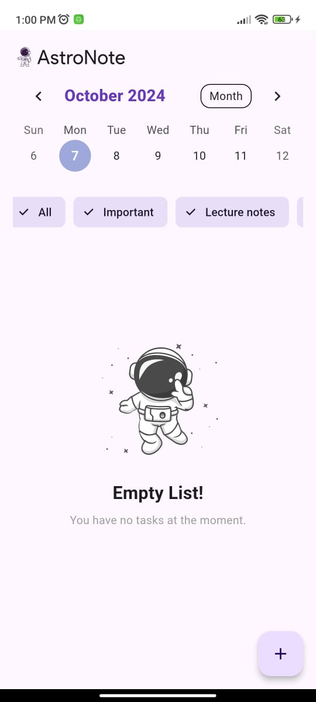
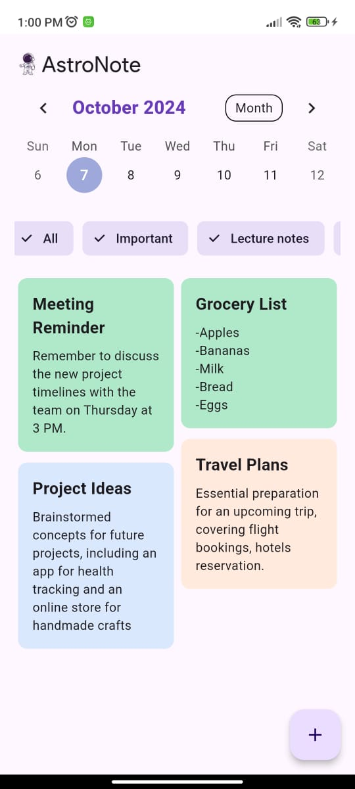
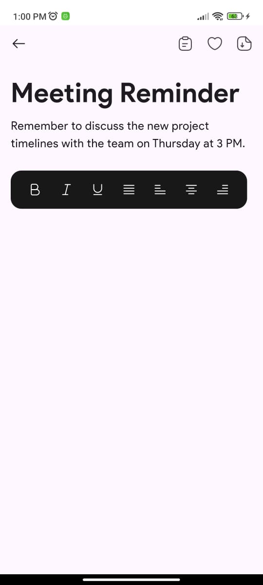

# 📝 Taskly

A productivity application built with Flutter that helps users manage their notes and tasks efficiently. Taskly allows users to create, edit, and organize notes with a user-friendly interface.

## 🛠️ Technologies

- **Flutter**
- **Dart**
- **Firebase** (for backend)

## ✨ Features

- Create and edit notes with rich text formatting (bold, italic, underline).
- Organize notes with categories (Important, Lecture notes, To-do lists).
- Real-time sync using Firebase Firestore.
- User-friendly interface with customizable options.

## 🚦 Running the Project

To run the project locally, follow these steps:

1. **Clone the repository**:

    ```bash
    git clone https://github.com/your-username/taskly.git
    cd taskly
    ```

2. **Install dependencies**:

    ```bash
    flutter pub get
    ```

3. **Set up Firebase**:

   - Create a Firebase project and enable Firestore.
   - Download the `google-services.json` (for Android) or `GoogleService-Info.plist` (for iOS) and place it in the appropriate directory:
     - For Android: `android/app/`
     - For iOS: `ios/Runner/`

4. **Run the app**:

    ```bash
    flutter run
    ```

## 📦 Project Structure

```bash
lib/
├── database/
│   └── firebase_database.dart # Firebase database service
├── widgets/
│   ├── editor.dart            # Custom text editor widget
│   └── note_view.dart         # Note view screen
├── main.dart                  # Entry point of the application
└── pubspec.yaml               # Project configuration and dependencies
```

### 🔐 How It Works

The app provides a rich text editor for users to create and format their notes. Users can toggle formatting options like bold and italic while editing their notes. The notes are stored in Firebase, ensuring they are accessible across devices.


### 📲 Using Taskly

```
1. Open the app and create a new note.
2. Use the toolbar to format your text.
3. Organize notes by categories to keep track of important information.
```

## 🎥 Photos
<div>
  
  
  
</div>
